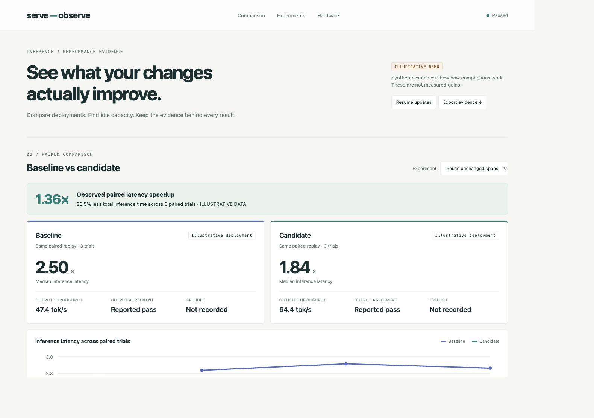

# serve-observe

**See whether an inference change actually improves performance.**

A small, self-hosted observability library and dashboard for AI inference deployments.
Compare a baseline with a candidate, see GPU activity alongside request demand,
and keep a readable history of your optimization experiments.



## Why use it?

A busy GPU does not always mean a faster service. A faster benchmark does not
explain where the gain came from. serve-observe brings the evidence together:

- **Compare before and after.** View paired latency, output throughput and the
  producer's correctness result side by side.
- **Find idle capacity.** See estimated GPU engine inactivity together with
  running and waiting requests.
- **Track experiments.** Plot measured results across successive code or
  deployment changes, including regressions and unverified results.
- **Give agents useful evidence.** Export structured reports and retained
  samples for an optimizer, notebook or CI pipeline.
- **Keep data local.** SQLite captures, JSON exports and a browser dashboard;
  no hosted service or account required.

## Try the dashboard

Requires Python 3.11 or newer.

```bash
pip install git+https://github.com/edreisMD/serve-observe.git
serve-observe dashboard --demo
```

Open **http://127.0.0.1:8765**. The demo uses clearly labeled synthetic data to
show two deployment captures and an experiment history. It is an example of the
interface, not a performance claim.

Browse the [four-slide overview](docs/serve-observe-overview.pptx) for a walkthrough
of the dashboard, deployment comparisons and experiment history.

## Monitor vLLM or SGLang

1. Run NVIDIA DCGM Exporter on the GPU host and enable the engine activity field.
2. Expose the serving metrics endpoint. SGLang requires `--enable-metrics`.
3. Copy `examples/vllm.toml` or `examples/sglang.toml`. Set the endpoint URLs,
   actual exported scheduler labels, and GPU UUIDs assigned to one worker.
4. Collect a capture while your fixed workload runs:

```bash
serve-observe collect --config worker.toml --db baseline.sqlite --duration 120
serve-observe collect --config candidate.toml --db candidate.sqlite --duration 120
serve-observe dashboard --db baseline.sqlite --db candidate.sqlite
```

The dashboard can read an active capture while collection continues. Every
capture stays available for reporting:

```bash
serve-observe report --db candidate.sqlite --out report.json
serve-observe export --db candidate.sqlite --out samples.jsonl
```

## Watch optimization results

Have your benchmark write paired result files using the
[documented JSON format](docs/benchmarks.md), then watch the directory:

```bash
serve-observe dashboard --benchmark-dir ./results
```

New results appear automatically. Speedups are recomputed from paired timings,
not copied from an advertised score. Each point compares that experiment with
its own reference; history is not a claim of cumulative or statistically proven
improvement. Correctness flags are supplied by the benchmark producer.

On Apple Silicon you can also record available system-wide GPU counters:

```bash
serve-observe dashboard --benchmark-dir ./results --monitor-local \
  --journal ./local-telemetry.jsonl
```

Apple activity is labeled separately from DCGM. It includes other applications
and cannot attribute GPU idle time to one inference process.

## Useful measurements, honest limits

DCGM engine inactivity is an **estimate from interval averages**. It distinguishes
idle correlated with no demand from idle correlated with running or queued work.
It does not explain the cause or expose microsecond kernel gaps. Unsupported,
stale, duplicate or missing metrics remain unknown; outages reduce coverage.

For detailed investigations, analyze an existing Chrome/PyTorch GPU trace:

```bash
serve-observe trace --input trace.json --device 0 \
  --start-us 1000000 --end-us 2000000 --out trace-gaps.json
```

See [measurement details](docs/measurements.md) and the
[experiment workflow](docs/agent-loop.md). Optimize useful throughput or cost
under correctness and latency constraints; utilization alone is not a reward.

## Python library

```python
from serve_observe import Store, analyze

with Store("capture.sqlite", readonly=True) as store:
    config, frames, identity = store.read()
    report = {**analyze(config, frames), **identity}
```

The collector runs outside the inference request path. It does not import a
serving engine, change clocks, route requests or modify your deployment.

## Status and contributing

Alpha. Tested with synthetic/local HTTP exporters and real Apple driver counter
reads. Real NVIDIA deployments still need hardware validation. Metrics and
scheduler labels vary by engine release; check your `/metrics` output.

```bash
git clone https://github.com/edreisMD/serve-observe.git
cd serve-observe
uv sync --frozen --dev
uv run pytest
uv run ruff check .
uv run ruff format --check .
uv build
```

The dashboard binds to loopback only and is intended for local use. Metrics
labels, endpoint URLs and supplied metadata may contain deployment information;
review exports before sharing them. Long captures should be rotated; reporting
currently reads a complete run into memory. The local telemetry journal is
bounded and keeps one rotated file.

**MIT licensed.** Contributions, real deployment fixtures and bug reports are welcome.
