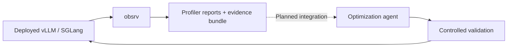

# obsrv

**Production profiling evidence for the next optimization of your AI serving stack.**

[](pyproject.toml)
[](LICENSE)
[](docs/validation.md)

Obsrv attaches to a **vLLM or SGLang deployment**, captures its runtime behavior,
and exports evidence that an optimization agent can use to develop its next hypothesis.
It brings VibeSys's profiling analysis to deployed inference servers.

Instead of optimizing only against isolated experiments, observe what the deployed
implementation actually does under its application workload. Use that evidence to
choose the next experiment, then validate the change before deploying it.



> **Experimental alpha:** local package and HTTP protocol tests pass. Real NVIDIA
> deployment compatibility and collection/profiling overhead still need validation.
> VibeSys hypothesis-loading integration is planned, not implemented.

## What you get

- **VibeSys profiler analysis:** kernel/operator costs, CPU/GPU overhead, memory
  operations, trace certification, correlated GEMM shapes and available roofline analysis.
- **Explicit capture windows:** start and stop the engine's native PyTorch profiler
  without injecting code, restarting the server or generating synthetic requests.
- **Nsight Systems imports:** analyze existing kernel, launch/synchronization, GPU-gap,
  memory and CUDA graph replay evidence.
- **Portable evidence:** complete JSON records, a compact agent-context summary,
  trace artifacts and a SHA256 integrity manifest.
- **Optional continuous context:** serving latency/throughput/queue/cache metrics and
  explicitly configured DCGM telemetry. These supplement the profiler evidence.

Obsrv is a headless SDK and CLI. It is not a dashboard, an inference engine, or an
agent that edits/deploys code. Production observations guide hypotheses; they do not
prove a speedup or replace correctness and controlled performance tests.

## Install

Requires **Python 3.11+**. Install from `main` in a separate environment:

```bash
python3 -m venv .obsrv-venv
source .obsrv-venv/bin/activate
python -m pip install "git+https://github.com/edreisMD/obsrv.git@main"
obsrv --help
```

Or clone it to inspect/edit the source:

```bash
git clone --branch main https://github.com/edreisMD/obsrv.git
cd obsrv
python3 -m venv .venv
source .venv/bin/activate
python -m pip install .
```

The `main` branch contains the production profiler. The earlier dashboard is retained
in Git history and in the local archived package.
This project has **not been published on PyPI**; do not assume `pip install obsrv`
installs this package. The collector itself does not require PyTorch or CUDA.
The serving engine needs a supported NVIDIA/CUDA environment for live GPU captures.

Install the serving engine using its own [vLLM](https://docs.vllm.ai/en/stable/getting_started/installation/gpu/)
or [SGLang](https://docs.sglang.ai/get_started/install.html) installation guide.
The engine and collector can run in separate environments or containers.

For a first cluster trial and manual VibeSys handoff, see the
[friend quickstart](docs/friend-quickstart.md).

## Quickstart with vLLM

Use vLLM **0.13 or later** with the native `--profiler-config` interface.
Run these terminals on the same host. For separate containers, use a shared trace
volume and a reachable private serving address as described in the deployment guide. Choose your own model; `YOUR_MODEL` is a placeholder.

**Terminal 1 — launch the server in your vLLM environment:**

```bash
export MODEL=YOUR_MODEL
export PROFILE_DIR=/tmp/obsrv-vllm-profiles
mkdir -p "$PROFILE_DIR"

vllm serve "$MODEL" --host 127.0.0.1 --port 8000 \
  --profiler-config "{\"profiler\":\"torch\",\"torch_profiler_dir\":\"$PROFILE_DIR\",\"torch_profiler_record_shapes\":true,\"torch_profiler_with_memory\":true,\"torch_profiler_with_stack\":false}"
```

**Terminal 2 — activate obsrv in its environment:**

```bash
obsrv activate --engine vllm --url http://127.0.0.1:8000 \
  --deployment coding-vllm --trace-dir /tmp/obsrv-vllm-profiles
```

Activation discovers the advertised model and available engine version, saves the
configuration and starts passive collection in the foreground. Add `--revision`
with the deployed code commit or image digest to identify the implementation precisely.
Deep profiling starts only when you request it.

**Terminal 3 — while your application is sending traffic:**

```bash
obsrv profile --deployment coding-vllm --duration 30
obsrv report --deployment coding-vllm
obsrv export-context --deployment coding-vllm
```

The profiler analyzes the application traffic present in that window. An idle server
cannot produce meaningful GPU bottleneck evidence. Profiling perturbs serving; use
an appropriate diagnostic window and inspect trace certification before drawing conclusions.
See the engine's [profiling guide](https://docs.vllm.ai/en/stable/contributing/profiling/).

## Quickstart with SGLang

**Terminal 1 — launch the server in your SGLang environment:**

```bash
export MODEL=YOUR_MODEL
export SGLANG_TORCH_PROFILER_DIR=/tmp/obsrv-sglang-profiles
mkdir -p "$SGLANG_TORCH_PROFILER_DIR"

python -m sglang.launch_server --model-path "$MODEL" \
  --host 127.0.0.1 --port 30000 --enable-metrics
```

**Terminal 2 — activate obsrv:**

```bash
obsrv activate --engine sglang --url http://127.0.0.1:30000 \
  --deployment coding-sglang --trace-dir /tmp/obsrv-sglang-profiles
```

**Terminal 3 — capture application traffic and export evidence:**

```bash
obsrv profile --deployment coding-sglang --duration 30
obsrv report --deployment coding-sglang
obsrv export-context --deployment coding-sglang
```

Obsrv requests CPU/GPU activities and input shapes through SGLang's native profiling
endpoints, disables stack recording and keeps each capture's output separate.
Use an engine version supporting these request fields. See SGLang's
[profiling guide](https://docs.sglang.ai/developer_guide/benchmark_and_profiling.html).

## Understand the output

`export-context` prints the path to a self-contained export directory:

```text
exports/<bundle-id>/
├── bundle.json       # complete deployment, observation and profiler records
├── context.md        # agent-context summary, capped at 16,384 characters
├── manifest.json     # bundle, summary and artifact SHA256 hashes
└── artifacts/        # exact captured trace bytes, addressed by SHA256
```

```bash
obsrv verify /path/to/export
```

The generated `ProductionEvidenceBundle` uses VibeSys-style metric and artifact-digest
conventions. It is **not** VibeSys `TrustedEvidence`; correctness and official gate
acceptance remain `not_evaluated`. The future hypothesis importer must validate and
bind production observations to the candidate being optimized.

Automatic discovery does not attest code identity or distributed topology. Revision
starts as `unknown` unless supplied; workers start as `unattributed`. A capture may
return `partial` (exit code 2) while still preserving useful traces. Configure real
worker identities and trace patterns before claiming complete worker coverage.

Kernel duration sums can exceed elapsed time because GPU streams overlap. Obsrv keeps
per-device interval unions separate. Production cohorts are not paired benchmarks,
and profiled latency is not an unprofiled serving-performance measurement.

## Commands at a glance

| Command | Purpose |
| --- | --- |
| `activate --engine … --url … --deployment …` | Discover, configure and start passive collection |
| `deployment-settings --engine … --trace-dir …` | Print launch settings without launching a model |
| `collect --deployment …` | Resume collection using the saved configuration |
| `profile --deployment … --duration 30` | Capture and analyze an explicit profiling window |
| `profile --deployment … --recover CAPTURE_ID` | Recover an interrupted owned capture |
| `import --deployment … --profiler torch\|nsys --worker … FILE` | Analyze an existing trace |
| `report --deployment … --all-versions` | Inspect separate version cohorts |
| `export-context --deployment …` | Export complete evidence and compact context |
| `verify EXPORT_DIR` | Verify an export's integrity |

Run named-deployment commands from the **same working directory as activation**.
Otherwise use the absolute `--config` path printed by activation. `activate --setup-only`
saves configuration without collecting; `--count 2` performs a finite collection check.

## SDK

```python
from obsrv import Config, Collector, EvidenceStore, ProfileController, export_context

config = Config.load("/path/to/obsrv.json")
store = EvidenceStore(
    config.state_dir,
    retention_days=config.retention_days,
    max_bytes=config.max_storage_bytes,
)
try:
    Collector(config, store).collect_once()  # passive
    ProfileController(config, store).capture(duration_seconds=30)  # explicit diagnostic
    export_dir = export_context(store, config.identity)
finally:
    store.close()
```

## Deployment and privacy

Run an adjacent process/sidecar against **one deployment's internal admin endpoint**,
not a load balancer that can route start and stop to different replicas. Use a shared
trace volume and state/lock volume. If the server and collector mount paths differ,
set `server_trace_dir` for SGLang; vLLM must write into the configured shared volume.

Data stays local. Obsrv submits no prompts/completions and uploads no evidence to a
cloud service. Tokens are referenced through `--auth-env ENV_VAR`, never embedded in
URLs or stored in exports. Raw engine traces are preserved exactly and may contain
engine-generated names, annotations or paths: **exports are not automatically redacted**.
Review them before sharing, and keep runtime state out of Git.

Default record retention is 7 days with a 5-GiB data budget. Exports are preserved;
quota exhaustion pauses new data writes. Trace flushing has a separate timeout and
may outlast the active profiling window. Recovery is explicit after an ambiguous stop.

| Guide | Details |
| --- | --- |
| [Deployment guide](docs/deployment.md) | Existing servers, auth, workers, containers, recovery and optional metrics |
| [Profiler contract](docs/profiler-contract.md) | Exact VibeSys measurements, limitations and source provenance |
| [VibeSys integration](docs/vibesys-integration.md) | Evidence contract and future hypothesis-loading boundary |
| [Privacy](docs/privacy.md) | Local storage, sharing and publication exclusions |
| [Validation](docs/validation.md) | What has been tested and what has not |
| [NVIDIA validation](docs/nvidia-validation.md) | Opt-in validation on real serving engines |

## Development

```bash
python -m pip install --upgrade pip
python -m pip install -e . --group dev
python -m pytest
python -m ruff check src tests scripts
python -m ruff format --check src tests scripts
python scripts/check_release.py
```

The dependency-group install requires a recent pip; alternatively use `uv sync --locked`.
CI checks Python 3.11–3.14 on Linux, builds distributions and audits their contents.
GPU tests are opt-in and are not run by this CPU-only CI.
See [CONTRIBUTING.md](CONTRIBUTING.md) and the [release checklist](docs/releasing.md).

## Attribution

Obsrv uses the MIT-licensed profiling analyzers from
[VibeSys](https://github.com/uw-syfi/vibesys), pinned at revision
`41dd0a8eb2db160c3ae43e4472401cd663f839e5`. Original notices and source/packaged hashes
are retained in [`src/obsrv/_vendor`](src/obsrv/_vendor). Analysis is adapted for a
standalone package; VibeSys orchestration is not bundled.

[MIT license](LICENSE).
